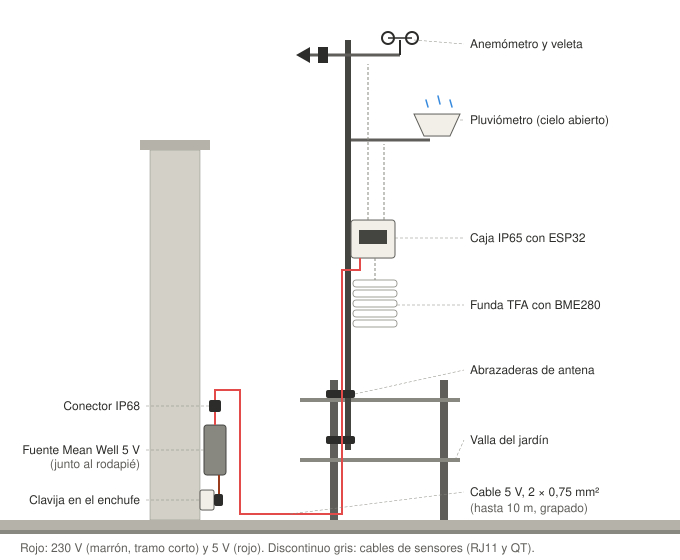

# Estación meteorológica casera: especificación del proyecto

Documento de arranque para la sesión de código. Recoge todas las decisiones tomadas, el hardware comprado, el montaje, las pruebas y la arquitectura de software (firmware, backend en Supabase y front-end).

Fecha de la especificación: 30 de septiembre de 2026.

---

## 0. Cómo usar este documento

- El proyecto vive en **un único repositorio** (monorepo) con tres módulos: `firmware/`, `supabase/` y `web/`, más `docs/`.
- **Orden de trabajo obligatorio:** primero se prueba el hardware en la mesa (fase 1), módulo a módulo. No se construye backend ni front-end hasta que el firmware lee bien todos los sensores.
- Cada prueba de hardware se documenta en `docs/hardware-log.md`: qué se probó, si funcionó, qué valores dio y qué se ajustó. Ese log es la memoria del proyecto.
- Vocabulario: **flashear** = compilar el firmware en el Mac y grabarlo por USB en la memoria del ESP32. (No usar "subir".)
- Donde este documento dice **"verificar"**, el dato viene de fichas o de memoria y hay que confirmarlo con el material real o su datasheet antes de darlo por bueno.

---

## 1. Objetivo

Una estación meteorológica en el jardín de casa (Las Rozas, Madrid) que:

1. Mide temperatura, humedad, presión, velocidad del viento, racha, dirección del viento y lluvia.
2. Se conecta al WiFi de casa y envía una lectura por minuto a una base de datos en Supabase.
3. Guarda un histórico desde el primer día, sin borrar datos brutos.
4. Se consulta desde un front-end web propio (React + TypeScript) desplegado en un servidor, con valores actuales, gráficas e histórico.
5. El índice UV se obtiene de Open-Meteo (no hay sensor UV propio).

---

## 2. Decisiones tomadas (y descartadas)

| Tema | Decisión | Motivo |
|---|---|---|
| Plataforma | ESP32 (38 pines, USB-C, CP2102) | Barato, WiFi integrado, muy documentado |
| Móvil viejo como estación | Descartado | Mucha complejidad, sensores poco fiables (sin termómetro real, batería al sol) |
| Pantalla local (proyecto ESP32-S3 con display) | Descartada | La estación exterior no lleva pantalla |
| Soldar | Nada que soldar | Placa de bornas de tornillo, conectores QT, adaptadores RJ11 con bornas, WAGO |
| Temperatura/humedad/presión | BME280 (Adafruit, STEMMA QT) | Tres medidas en un sensor, I²C |
| Viento y lluvia | Kit tipo SparkFun SEN-15901 (BricoGeek, ref. SEN-0051) | Interruptores reed, cables RJ11, pluviómetro 0,2794 mm/vuelco. Misma guía y especificaciones que SparkFun |
| Sensor UV (LTR390) | Descartado | Necesita ventana de cuarzo (JGS1/JGS2); unos 60 € en Amazon por un disco, o semanas desde China. El UV se saca de Open-Meteo |
| Protección del BME280 | Funda TFA 98.1114.02 (pantalla de radiación de platos) | Sin ella el sol falsea la temperatura varios grados |
| Ubicación | Mástil del kit sujeto a un tubo de la valla del jardín con abrazaderas metálicas de antena | Cielo abierto para el pluviómetro, viento libre |
| Alimentación | Enchufe exterior (a la altura del rodapié) → fuente Mean Well 5 V IP67 junto al enchufe → cable de 5 V hasta la caja | Por el exterior solo corren 5 V; no se alarga 230 V |
| Empalme fuente-cable | Conector estanco IP68 a la intemperie | Los WAGO no son estancos |
| Portafusibles | Eliminado | La Mean Well ya protege contra cortocircuito, sobrecarga y sobretensión |
| Prensaestopas | Eliminados | La caja trae conos de goma como entradas de cable |
| Backend | Supabase (Postgres) | Ya usado en otros proyectos |
| Envío de datos | 1 registro por minuto, HTTPS a una Edge Function | Evita meter claves con permisos amplios en el firmware |

---

## 3. Lista de la compra definitiva

Precios tal como aparecían en la cesta el 30/09/2026. Los enlaces que no se guardaron durante la compra están marcados como pendientes: rellénalos desde el historial de pedidos.

### 3.1 Amazon.es (total cesta: 140,77 €, antes de cupones)

| Pieza | Precio | Enlace / notas |
|---|---|---|
| ESP32 38 pines, USB-C, CP2102 ("1 Pieza 38pin USB C ESP32 NodeMCU WROOM 32") | 15,98 € | https://www.amazon.es/dp/B0DB8F8MKH — **Verificar** que la separación entre filas de pines sea 2,55 cm |
| Placa de expansión DUBEUYEW 38 pines, versión ancha (paso 2,55 cm), pack de 2 | 9,99 € | https://www.amazon.es/dp/B0BJF1W86K |
| Kit de cables Qwiic / STEMMA QT (JST SH 1.0, 4 pines) | 10,99 € | Enlace pendiente. Se usa 1 cable con pines macho |
| QUARKZMAN RJ11 6P4C hembra a terminal de tornillo, pack de 2 | 7,99 € | Enlace pendiente. Uno para viento, otro para lluvia |
| Resistencias Luftschloss 10 kΩ 1/2 W 1 %, 50 unidades | 6,50 € | Enlace pendiente. Se usan 3 |
| WAGO 221-415 (5 entradas), pack de 5 | 7,61 € | Enlace pendiente. Se usa 1 |
| Caja estanca IP65 con conos, 150 × 110 × 70 mm, blanca | 9,99 € | Enlace pendiente |
| Cable 2 × 0,75 mm² (18 AWG), 10 m, UL2464 (Matugajp) | 19,97 € | Enlace pendiente. No certificado para sol directo: si se agrieta con los años, cambiar o meter en tubo corrugado |
| Conector estanco IP68 450 V 2P+T, 0,5–2,5 mm², pack de 3 (Todoelectrico) | 11,90 € | https://www.amazon.es/dp/B09SG8PNQH — Sin tornillos. Se usan 2 de los 3 polos |
| Clavija schuko IP44 macho reutilizable, pack de 2 | 9,49 € | Enlace pendiente |
| Fuente Mean Well LPV-20-5 (5 V, 3 A, 15 W, IP67) | 15,66 € | Enlace pendiente. Vendida por IT-Tronics GmbH, entrega 13–15 oct |
| TFA 98.1114.02, funda protectora para transmisor exterior | 14,70 € | Enlace pendiente. Interior 160 × 60 mm |

### 3.2 BricoGeek (precios sin IVA)

| Pieza | Precio sin IVA | Con IVA (21 %) | Notas |
|---|---|---|---|
| Kit estación meteorológica con mástil (ref. SEN-0051) | 85,00 € | 102,85 € | Anemómetro, veleta, pluviómetro, mástil de dos piezas, brazos, 2 abrazaderas, bridas. Equivalente al SparkFun SEN-15901 |
| Sensor BME280 (ref. SEN-0086), Adafruit con 2 conectores STEMMA QT | 17,95 € | 21,72 € | Los pines sueltos que trae no se usan |

Total BricoGeek: 102,95 € sin IVA (124,57 € con IVA), más envío.

### 3.3 Ya en casa

- Cable USB-C a USB-C de datos (el del iPhone 15 o posterior).
- Cable fino para las conexiones dentro de la caja: sobrantes del kit QT (cortando las fundas hembra), sobrante del cable de 2 × 0,75 mm² o cualquier cable de casa.

### 3.4 Ferretería o casa (pendiente)

- 2 abrazaderas metálicas de antena, tubo a tubo (medir diámetros de la valla y del mástil).
- Bridas negras resistentes a UV (las blancas se degradan al sol).
- Silicona neutra (no acética: la acética corroe la electrónica).
- Grapas o abrazaderas para cable (cada 30–50 cm).
- Tacos y tornillos para fijar la fuente a la pared.
- Destornillador de precisión plano de 2–2,5 mm.
- Pelacables.
- Opcional: cinta de doble cara gruesa para fijar la placa dentro de la caja.
- Opcional: mástil de antena extra si el del kit no sobresale lo suficiente.

---

## 4. Hardware

### 4.1 Esquema general

```
 Enchufe exterior (rodapié)
   │  230 V (tramo corto)
   ▼
 Clavija schuko IP44 ── Fuente Mean Well LPV-20-5 (fijada a la pared, levantada del suelo)
                           │ salida 5 V: rojo (+V), negro (−V)
                           ▼
                  Conector estanco IP68 (a la intemperie)
                           │
                           ▼
          Cable 2 × 0,75 mm² (hasta 10 m, grapado; bucle de goteo antes de cada entrada)
                           │
                           ▼ (entra por un cono, hacia abajo o de lado)
 ┌──────────────────── Caja IP65 en el mástil ────────────────────┐
 │  Placa de bornas 38 pines + ESP32                                │
 │  2 × adaptador RJ11 con bornas (viento, lluvia)                  │
 │  WAGO 221-415 (reparto de 3,3 V)                                 │
 │  3 resistencias de 10 kΩ                                         │
 └──────────────────────────────────────────────────────────────────┘
        │ cable QT                 │ RJ11 viento        │ RJ11 lluvia
        ▼                          ▼                    ▼
  BME280 en funda TFA      Anemómetro + veleta      Pluviómetro
  (colgando, centrado)     (barra superior)         (brazo, cielo abierto)

 Mástil del kit sujeto a un tubo de la valla con 2 abrazaderas de antena.
```



*Dibujo de referencia del montaje. El archivo `montaje-estacion.svg` debe estar en la misma carpeta que este documento (`docs/`).*

### 4.2 Componentes y especificaciones

**ESP32 (placa de desarrollo)**
- Módulo ESP-WROOM-32, 38 pines, USB-C, chip USB-serie CP2102. En macOS puede hacer falta el driver del CP2102 si no aparece el puerto.
- Se alimenta en la instalación por la borna **5V** de la placa de expansión (no por USB). El USB solo para flashear y depurar.
- ADC: usar **solo pines ADC1 (GPIO 32–39)** para lecturas analógicas; ADC2 no funciona con el WiFi activo.
- GPIO 34–39 son solo entrada y sin pull-up interno.
- Consumo: media ~0,5 W, picos 1–1,5 W al transmitir por WiFi.

**Placa de expansión DUBEUYEW**
- 38 pines, versión ancha (2,55 cm entre filas), 7,7 × 6,3 cm, bornas de tornillo con 2 bornas por pin.

**BME280 (Adafruit, STEMMA QT)**
- Temperatura, humedad, presión. I²C en dirección **0x77** por defecto en la placa Adafruit (0x76 si se puentea SDO a GND). **Verificar** con el escáner I²C.
- Cable QT, colores estándar Qwiic: **negro = GND, rojo = 3,3 V, azul = SDA, amarillo = SCL**. Verificar con el cable real.
- Leer en **modo forzado** una vez por minuto para evitar autocalentamiento.
- Dentro de la funda TFA, colgando en el centro, sin tocar las paredes; la parte de abajo abierta.
- Cable QT corto (unos 15 cm con pines macho). Si hace falta más, cortar un cable QT largo del kit, pelar y atornillar. I²C no aguanta cables largos: máximo ~1 m.

**Kit de viento y lluvia (equivalente SparkFun SEN-15901)**
- Sin electrónica activa: interruptores reed e imanes. Cables con clavija RJ11.
- **Pluviómetro:** cazoleta basculante, un cierre momentáneo por cada 0,011" = **0,2794 mm** de lluvia. No mide bien con helada o nieve. Resolución mínima 0,28 mm.
- **Anemómetro:** un cierre por vuelta. **1 cierre por segundo = 2,4 km/h = 0,667 m/s** (1,492 mph).
- **Veleta:** resistencias internas; con una resistencia fija forma un divisor de tensión. Hasta 16 posiciones (en la práctica 8 son más fiables).
- El anemómetro se conecta a la veleta y comparten un solo cable RJ11 hacia la caja.
- Pinout RJ11 (**verificar** con el datasheet y el multímetro): cable de viento, veleta en los dos conductores exteriores y anemómetro en los dos interiores; pluviómetro en los dos conductores centrales.

**Tabla de la veleta** (resistencias según el datasheet de SparkFun/Argent, **verificar**; voltajes calculados para 3,3 V con 10 kΩ a 3,3 V y veleta a GND: V = 3,3 × R / (R + 10 kΩ))

| Dirección | Grados | Resistencia | Voltaje esperado (3,3 V) |
|---|---|---|---|
| N | 0 | 33 kΩ | 2,53 V |
| NNE | 22,5 | 6,57 kΩ | 1,31 V |
| NE | 45 | 8,2 kΩ | 1,49 V |
| ENE | 67,5 | 891 Ω | 0,27 V |
| E | 90 | 1 kΩ | 0,30 V |
| ESE | 112,5 | 688 Ω | 0,21 V |
| SE | 135 | 2,2 kΩ | 0,60 V |
| SSE | 157,5 | 1,41 kΩ | 0,41 V |
| S | 180 | 3,9 kΩ | 0,93 V |
| SSO | 202,5 | 3,14 kΩ | 0,79 V |
| SO | 225 | 16 kΩ | 2,03 V |
| OSO | 247,5 | 14,12 kΩ | 1,93 V |
| O | 270 | 120 kΩ | 3,05 V |
| ONO | 292,5 | 42,12 kΩ | 2,67 V |
| NO | 315 | 64,9 kΩ | 2,86 V |
| NNO | 337,5 | 21,88 kΩ | 2,27 V |

- Hay valores muy juntos (ENE/E/ESE). Usar búsqueda del valor más cercano y **calibrar empíricamente**: girar la veleta a cada posición y anotar la lectura real en `docs/hardware-log.md`.
- El ADC del ESP32 no es lineal y se satura cerca de 3,1 V con atenuación de 11 dB: la posición O (3,05 V) puede quedar en el límite. Usar `analogReadMilliVolts()` y la tabla calibrada.
- El "norte" de la veleta depende de cómo se oriente en el mástil: orientar la marca N al norte real o aplicar un offset en el firmware.

**Alimentación**
- Mean Well LPV-20-5: 5 V, 3 A, IP67, −30 a +70 °C, con protecciones. Cables sueltos en ambos lados. Doble aislamiento: entrada de solo 2 hilos (fase y neutro; comprobar colores en la etiqueta). Tierra de la clavija sin conectar.
- Montar la clavija schuko en la entrada de 230 V. Si no hay seguridad trabajando con 230 V, que lo haga un electricista.
- Caída de tensión en 10 m de 0,75 mm² con el consumo del ESP32: despreciable (menos de 0,1–0,2 V).
- **Polaridad:** rojo a 5V, negro a GND. Invertir puede quemar el ESP32.

### 4.3 Asignación de pines (propuesta, confirmar en fase 1)

| Función | GPIO | Notas |
|---|---|---|
| I²C SDA (BME280) | 21 | Cable azul del QT |
| I²C SCL (BME280) | 22 | Cable amarillo del QT |
| Anemómetro (pulsos) | 32 | Interrupción en flanco de bajada, pull-up externo 10 kΩ a 3,3 V |
| Pluviómetro (pulsos) | 33 | Interrupción en flanco de bajada, pull-up externo 10 kΩ a 3,3 V |
| Veleta (analógica) | 34 | ADC1, divisor con 10 kΩ a 3,3 V |
| LED integrado | 2 | Opcional, estado (verificar en la placa) |

### 4.4 Cableado dentro de la caja (sin soldar)

| Desde | Hasta |
|---|---|
| Cable de alimentación, hilo rojo (+5 V) | Borna **5V** |
| Cable de alimentación, hilo negro | Borna **GND** |
| Borna 3V3 (A) | Rojo del cable QT del BME280 |
| Borna 3V3 (B) | Cable corto al **WAGO 221-415** |
| WAGO | Resistencia pull-up anemómetro, resistencia pull-up pluviómetro, resistencia del divisor de la veleta (queda 1 entrada libre) |
| Otra pata de la resistencia del anemómetro | Borna GPIO 32 (A) |
| Otra pata de la resistencia del pluviómetro | Borna GPIO 33 (A) |
| Otra pata de la resistencia de la veleta | Borna GPIO 34 (A) |
| RJ11 viento, hilo del anemómetro | Borna GPIO 32 (B) |
| RJ11 viento, otro hilo del anemómetro | GND |
| RJ11 viento, hilo de la veleta | Borna GPIO 34 (B) |
| RJ11 viento, otro hilo de la veleta | GND |
| RJ11 lluvia, un hilo | Borna GPIO 33 (B) |
| RJ11 lluvia, otro hilo | GND |
| QT negro | GND |
| QT azul | GPIO 21 |
| QT amarillo | GPIO 22 |

- La placa tiene varias bornas GND: repartir ahí las masas.
- Usar colores distintos para 3,3 V, GND y señales.
- Las patas de las resistencias van directas a las bornas y al WAGO.

### 4.5 Montaje físico

- **Mástil:** el del kit (dos piezas), sujeto a un tubo de la valla con 2 abrazaderas de antena bien separadas. Comprobar que el tubo de la valla no se mueve.
- **Ubicación:** sin árboles ni paredes altas al lado; el pluviómetro con cielo abierto encima.
- **Caja IP65:** en el mástil, pegada a la funda TFA para que el cable QT llegue. Conos hacia abajo o de lado, nunca hacia arriba. Los conos se cortan a la medida del cable; los no usados quedan cerrados. Para pasar las clavijas RJ11 el cono queda holgado: sellar con silicona neutra.
- **Funda TFA:** en el mástil; el BME280 colgando dentro.
- **Fuente:** atornillada a la pared junto al enchufe, levantada del suelo.
- **Cable de 5 V:** grapado cada 30–50 cm. Bucle de goteo hacia abajo antes del conector IP68 y antes de entrar en la caja.
- **WiFi:** comprobar cobertura en el punto final (el firmware envía el RSSI con cada lectura).

---

## 5. Plan de trabajo por fases

### Fase 0: entorno
- Instalar VS Code + PlatformIO. Driver CP2102 si el Mac no ve el puerto.
- Crear el repositorio con la estructura de la sección 6.1.
- Probar el cable USB-C: si el Mac no detecta la placa, probar otro cable antes de culpar a la placa.

### Fase 1: banco de pruebas en la mesa (antes de cualquier backend)
Todo alimentado por USB. Cada prueba es un entorno de PlatformIO independiente en `firmware/` y se documenta en `docs/hardware-log.md`.

1. **Hola mundo:** imprimir por serie cada segundo (115200 baudios) y parpadear el LED. Valida placa, cable y flasheo.
2. **Encaje mecánico:** el ESP32 entra en la placa de bornas sin forzar (2,55 cm). Si no encaja, devolver.
3. **Escáner I²C:** debe aparecer el BME280 (0x77 o 0x76). Si no, revisar cableado.
4. **BME280:** temperatura, humedad y presión cada pocos segundos. Prueba: soplar (sube la humedad). Comparar la presión con AEMET o una estación cercana.
5. **Anemómetro:** girar las cazoletas con el dedo, contar pulsos. Ajustar antirrebote.
6. **Pluviómetro:** volcar la cazoleta a mano y comprobar 1 pulso por vuelco. Opcional: echar un volumen conocido de agua y contrastar.
7. **Veleta:** recorrer las 16 posiciones, anotar milivoltios reales y construir la tabla calibrada.
8. **WiFi:** conectar, mostrar IP y RSSI. Sincronizar hora por NTP.
9. **Integración:** todo junto, imprimiendo por serie el JSON que se enviaría cada minuto.

### Fase 2: backend
- Crear el proyecto en Supabase, aplicar migraciones (sección 6.3), desplegar la Edge Function de ingesta.
- Firmware enviando al backend. Probar cortes de WiFi (desconectar el router) y comprobar que el buffer reenvía sin duplicar.

### Fase 3: montaje en la caja
- Cableado definitivo según la sección 4.4. Alimentar por la borna 5V con la fuente (llega el 13–15 oct; hasta entonces, USB).

### Fase 4: instalación exterior y calibración
- Montaje físico según la sección 4.5.
- Orientar la veleta al norte (o fijar offset).
- Contrastar durante una o dos semanas con una estación de referencia cercana (AEMET u otra) y ajustar factores.

### Fase 5: front-end
- Desarrollo y despliegue (sección 6.5).

### Fase 6: mejoras
- Actualización del firmware por WiFi (OTA), alertas, etc.

---

## 6. Software

### 6.1 Estructura del repositorio

```
estacion-meteo/
├── README.md
├── docs/
│   ├── spec.md                 # este documento
│   ├── hardware-log.md         # log de pruebas: qué, resultado, valores
│   └── wiring.md               # cableado real tal como quedó montado
├── firmware/                   # PlatformIO, framework Arduino, ESP32
│   ├── platformio.ini          # un env por prueba de fase 1 + env "station"
│   ├── include/
│   │   ├── config.h            # pines, intervalos, factores de calibración
│   │   └── secrets.example.h   # plantilla; secrets.h va en .gitignore
│   ├── src/
│   │   ├── main.cpp            # firmware final
│   │   ├── sensors/            # bme280, wind, rain, vane
│   │   ├── net/                # wifi, ntp, uploader, buffer
│   │   └── util/
│   └── test-sketches/          # hello, i2c_scanner, bme280, anemometer, rain, vane, wifi
├── supabase/
│   ├── migrations/
│   └── functions/
│       └── ingest/index.ts
└── web/                        # React + TypeScript + Vite
```

### 6.2 Firmware

**Plataforma:** PlatformIO, framework Arduino, placa `esp32dev`. Librería del BME280: Adafruit BME280 (o equivalente).

**Comportamiento:**
- **Anemómetro:** interrupción en flanco de bajada con antirrebote (ignorar pulsos a menos de ~10 ms del anterior; a 100 km/h hay ~11,6 pulsos/s, periodo ~86 ms).
- **Pluviómetro:** interrupción con antirrebote más largo (~200 ms).
- **Contadores en ISR** con `volatile` y acceso atómico (sección crítica) al leerlos.
- **Viento medio:** pulsos del minuto / 60 s × 0,667 m/s.
- **Racha:** máximo de medias de 3 segundos dentro del minuto.
- **Dirección:** muestrear la veleta cada pocos segundos y hacer media circular (atan2 de la media de senos y cosenos), no media aritmética de grados.
- **Lluvia:** enviar los **mm caídos en ese minuto** (pulsos × 0,2794), nunca acumulados, para que un reinicio no corrompa el total.
- **BME280:** una lectura en modo forzado por minuto.
- **Hora:** NTP; timestamps en UTC. No enviar lecturas sin hora válida.
- **Buffer:** cola en RAM de lecturas pendientes (p. ej. hasta 24 h = 1440 registros; dimensionar según memoria). Si falla el envío, se reintenta en lote al volver el WiFi. Opcional: persistir en LittleFS para sobrevivir a reinicios.
- **Envío:** HTTPS POST a la Edge Function, en lote (array), con cabecera `x-device-key`. Idempotente gracias a la clave única `(device_id, ts)`.
- **Sin deep sleep:** va enchufado y necesita contar pulsos continuamente.
- **Robustez:** watchdog, reconexión WiFi automática, reinicio si lleva mucho tiempo sin poder enviar.
- **Secretos:** SSID, contraseña WiFi, URL de la función y clave del dispositivo en `secrets.h` (fuera de git).
- **Calibración en `config.h`:** factor mm/vuelco, factor m/s por Hz, offset de la veleta, tabla de milivoltios de la veleta.

**Payload** (cada elemento del array):

```json
{
  "device_id": "jardin-01",
  "ts": "2026-10-20T10:15:00Z",
  "temp_c": 18.4,
  "humidity_pct": 62.1,
  "pressure_hpa": 1016.3,
  "wind_avg_ms": 2.1,
  "wind_gust_ms": 4.6,
  "wind_dir_deg": 225,
  "rain_mm": 0.2794,
  "rssi": -67,
  "uptime_s": 86400,
  "fw": "0.1.0"
}
```

### 6.3 Supabase

**Tabla de lecturas brutas** (una fila por minuto; ~525 000 filas/año, asumible):

```sql
create table public.readings (
  id            bigint generated always as identity primary key,
  device_id     text        not null,
  ts            timestamptz not null,
  temp_c        real,
  humidity_pct  real,
  pressure_hpa  real,
  wind_avg_ms   real,
  wind_gust_ms  real,
  wind_dir_deg  smallint,
  rain_mm       real        not null default 0,
  rssi          smallint,
  uptime_s      integer,
  fw            text,
  inserted_at   timestamptz not null default now(),
  unique (device_id, ts)
);

create index readings_ts_idx on public.readings (ts desc);

alter table public.readings enable row level security;

-- Lectura pública (datos meteorológicos, no sensibles). Decidir si se prefiere solo usuarios autenticados.
create policy "lectura publica" on public.readings
  for select using (true);

-- Sin política de insert: solo escribe la Edge Function con la service role.
```

**Agregados** (para que las gráficas largas no consulten millones de filas; los brutos se conservan siempre):

```sql
create table public.readings_hourly (
  device_id      text        not null,
  hour           timestamptz not null,
  temp_avg       real, temp_min real, temp_max real,
  humidity_avg   real,
  pressure_avg   real,
  wind_avg_ms    real,
  wind_gust_max  real,
  wind_dir_deg   smallint,     -- media circular
  rain_mm        real,
  samples        integer,
  primary key (device_id, hour)
);

create table public.readings_daily (
  device_id      text not null,
  day            date not null,  -- día local Europe/Madrid (lluvia "desde medianoche")
  temp_avg       real, temp_min real, temp_max real,
  humidity_avg   real,
  pressure_avg   real,
  wind_avg_ms    real,
  wind_gust_max  real,
  rain_mm        real,
  samples        integer,
  primary key (device_id, day)
);
```

- Rellenar con funciones SQL que recalculen las últimas horas/días con `insert ... on conflict do update`, programadas con **pg_cron** (p. ej. cada 10 minutos recalcular las últimas 3 horas y el día actual).
- Dirección media: `degrees(atan2(avg(sin(radians(wind_dir_deg))), avg(cos(radians(wind_dir_deg)))))`, normalizada a 0–360.
- Días en hora local: `(ts at time zone 'Europe/Madrid')::date`.
- Habilitar lectura pública también en estas tablas si se decide lectura pública.
- Lluvia de las últimas 24 h (ventana móvil): suma de `rain_mm` en `readings` con `ts > now() - interval '24 hours'`.

**Edge Function `ingest`** (Deno/TypeScript), esquema:

```ts
import { createClient } from "npm:@supabase/supabase-js@2";

const supabase = createClient(
  Deno.env.get("SUPABASE_URL")!,
  Deno.env.get("SUPABASE_SERVICE_ROLE_KEY")!,
);

Deno.serve(async (req) => {
  if (req.method !== "POST") return new Response("Method not allowed", { status: 405 });
  if (req.headers.get("x-device-key") !== Deno.env.get("DEVICE_KEY")) {
    return new Response("Unauthorized", { status: 401 });
  }
  const body = await req.json();
  const rows = Array.isArray(body) ? body : [body];
  // Validar tipos y rangos (temp −40..60, humedad 0..100, rain_mm >= 0, etc.)
  const { error } = await supabase
    .from("readings")
    .upsert(rows, { onConflict: "device_id,ts", ignoreDuplicates: true });
  if (error) return new Response(error.message, { status: 500 });
  return new Response(JSON.stringify({ inserted: rows.length }), { status: 200 });
});
```

- Validar y descartar valores imposibles antes de insertar.
- `DEVICE_KEY` como secreto de la función; nunca la service role en el firmware.

### 6.4 Datos externos: índice UV

- Open-Meteo, sin clave: `https://api.open-meteo.com/v1/forecast?latitude=40.49&longitude=-3.87&hourly=uv_index&timezone=Europe/Madrid` (coordenadas aproximadas de Las Rozas: ajustar a la ubicación exacta).
- Es un dato de modelo, no medido. Para histórico UV, verificar qué ofrece su API de archivo.

### 6.5 Front-end

- **Stack:** React + TypeScript + Vite, Recharts para gráficas, `@supabase/supabase-js` para leer.
- **Despliegue:** hosting estático (Vercel, Netlify o Cloudflare Pages). Variables de entorno: URL de Supabase y anon key (solo lectura por RLS).
- **Vistas:**
  - **Ahora:** últimos valores, hora de la última lectura y aviso si lleva más de ~5 minutos sin datos (estación caída).
  - **Hoy / 24 h:** gráficas de temperatura, humedad, presión, viento (medio y racha) y lluvia acumulada del día.
  - **Histórico:** selector de rango; hasta pocos días usa `readings`, rangos largos usan `readings_hourly` o `readings_daily`.
  - **Lluvia:** barras por día y totales mensuales/anuales.
  - **Viento:** rosa de los vientos (frecuencia por dirección y velocidad).
  - **UV:** índice UV de Open-Meteo junto a los datos propios.
- Opcional: suscripción realtime de Supabase para refrescar "Ahora" sin recargar.
- Unidades: °C, %, hPa, km/h (convertir desde m/s), mm.

---

## 7. Riesgos y comprobaciones pendientes

| Riesgo | Acción |
|---|---|
| El ESP32 podría ser de versión estrecha (2,25 cm) y no encajar en la placa de bornas | Comprobar al recibir; devolver si no encaja |
| Pinout RJ11 y tabla de la veleta sin confirmar con el material real | Multímetro + datasheet en fase 1 |
| Dirección I²C del BME280 (0x76/0x77) | Escáner I²C |
| ADC del ESP32 no lineal y saturación cerca de 3,1 V | Calibrar la veleta con lecturas reales |
| Rebotes de los reed | Antirrebote en ISR, validar con pruebas |
| Autocalentamiento del BME280 | Modo forzado, 1 lectura/min |
| Cobertura WiFi en la valla | Registrar RSSI; si es malo, ESP32 con antena externa o repetidor |
| Entrada de agua | Conos hacia abajo, silicona neutra, bucles de goteo, conector IP68 |
| Cable UL2464 al sol | Revisar con los años; tubo corrugado si se degrada |
| Calor en la caja en verano | Caja blanca; si hace falta, visera o sombra |
| Trabajo con 230 V (clavija schuko) | Electricista si no hay seguridad |
| Nieve o helada | El pluviómetro no mide bien: marcar esos datos como dudosos |
| Fuente Mean Well llega 13–15 oct | Probar con USB mientras tanto |

---

## 8. Plantilla de `docs/hardware-log.md`

```markdown
## AAAA-MM-DD — Prueba: <nombre>
- Objetivo:
- Montaje / pines usados:
- Resultado: OK / Falla
- Valores observados:
- Problemas y solución:
- Cambios en config.h:
```
